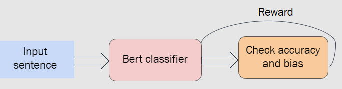

# reducing-gender-bias-using-RL
Reduce gender bias in machine learning models using reinforcement learning.

## What is it?
We introduce a method that reduces the bias in classifiers using policy gradient algorithm. The method uses classifiers from 🤗 Hugging Face ([link](https://github.com/huggingface/transformers)). 

## How it works
Reducing the bias in a sentiment analysis classifier using policy gradient can be summarized as follows:

1. **Training a vanilla classifier**: Train a classifier on sentiment analysis.
2. **Fine-tuning**: starting with the trained model, we fine-tune the weights using policy gradient approach. The model gets 2 rewards, a binary reward whenever is correctly predicts the label, and a negative reward whenever it gives a different prediction after swapping the gender in the sentence.
3. **Evaluation metrics**: To prove the efficacy of our approach, we use already existing metrics to measure the bias before and after applying policy gradient. The metrics used are: demagraphic parity, equality of odds, counterfactual token fairness, true negative rate, true positive rate and equality of opportunity.

This process is illustrated in the sketch below:

 <b>Figure:</b> The pipeline used in the policy gradient approach. 

## Installation

### Python package
Clone the repository, then install the required packages:

`pip -r install requirements.txt`

## Running the experiments

### Vanilla policy gradient
To run the experiment, type:

`python main.py`
