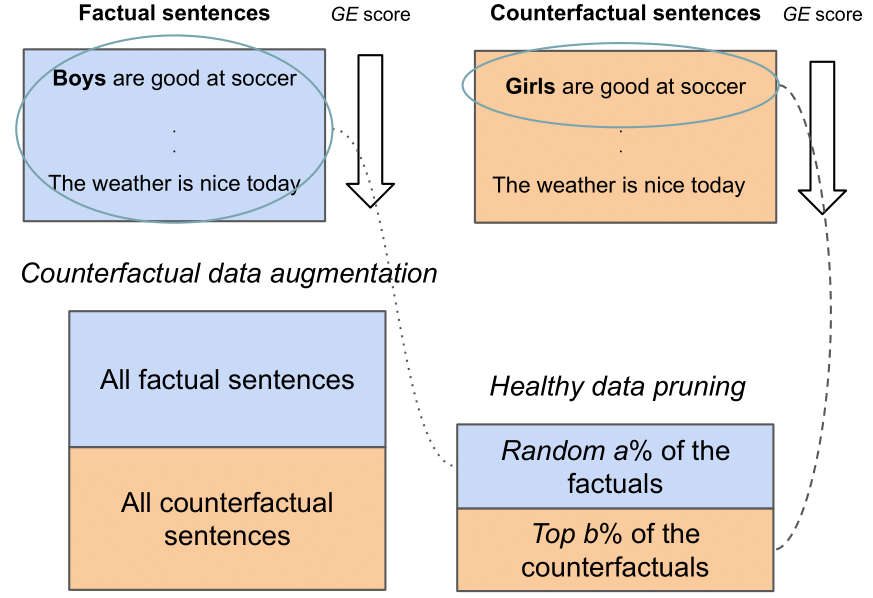

# Deep Learning on a Healthy Data Diet: Finding Important Examples for Fairness (AAAI 2023)
Mitigating gender bias in text classification models by removing the stereotypical examples ([paper](https://arxiv.org/pdf/2211.11109.pdf)). We use the classifiers from 🤗 Hugging Face ([link](https://github.com/huggingface/transformers)). 


## How it works
Healthy data diet can be summarized as follows:

1. **Generating the counterfactual examples**
2. **Finding the important examples for fairness using the GE score**
3. **Adding a pruned version of the original dataset to the important counterfactual examples** 

<div style="text-align: center">

<p style="text-align: center;"> </p>
</div>

## Installation

### Python package
Clone the repository, then install the required packages as follows:

`pip install -r requirements.txt`

## Running the experiments

**Computing the scores**
The following command is used to
compute the GE scores for the Twitter dataset using a BERT
model and a seed of 1 when the state of early training is set
to 1 epoch:

`python main.py --dataset Twitter --seed 1 --classifier_model bert-base-cased --CDA_examples_ranking GE --batch_size_biased_model 64 --num_epochs_importance_score 1 --num_epochs_biased_model 1 --batch_size_debiased_model 64 --num_epochs_debiased_model 1 --analyze_results True -- compute_importance_scores True`


**Experiment 1: Verifying that GE score reflects the
importance of counterfactual examples**
The following command is used to do debiasing using data augmentation
for the Twitter dataset using a RoBERTa model and a seed of
3 using 75% of the counterfactual examples that are ranked
according to the EL2N score:

`python main.py --dataset Twitter --classifier_model roberta-base --seed 3 --data_augmentation_ratio 0.75 --CDA_examples_ranking EL2N --batch_size_biased_model 64 --num_epochs_biased_model 15 --batch_size_debiased_model 64 --method data_augmentation --num_epochs_debiased_model 15 --analyze_results True`

**Experiment 2: Finding the best trade-off between fairness and performance**
The following command is used
to do debiasing with 30% of the factual examples and 20%
of the counterfactual examples using the proposed healthy
random ranking for the Jigsaw dataset with RoBERTa model
and a seed of 5:

`python main.py --batch_size_biased_model 32 --seed 5 --num_epochs_biased_model 10 --dataset Jigsaw --batch_size_debiased_model 32 --method data_diet --num_epochs_debiased_model 10 --classifier_model roberta-base --max_length 40 --analyze_results True --data_diet_factual_ratio 0.3 --data_diet_counterfactual_ratio 0.2 --data_diet_examples_ranking healthy_random`

## Citation
```
@article{zayed2022deep,
  title={Deep Learning on a Healthy Data Diet: Finding Important Examples for Fairness},
  author={Zayed, Abdelrahman and Parthasarathi, Prasanna and Mordido, Goncalo and Palangi, Hamid and Shabanian, Samira and Chandar, Sarath},
  journal={arXiv preprint arXiv:2211.11109},
  year={2022}
}
