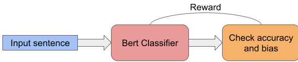

# reducing-gender-bias-using-RL
Reduce gender bias in machine learning models using reinforcement learning.

## What is it?
We introduce a method that reduces the bias in classifiers using policy gradient algorithm. The method uses classifiers from 🤗 Hugging Face ([link](https://github.com/huggingface/transformers)). 

## How it works
Reducing the bias in classifiers using policy gradient can be summarized as follows:

1. **Training a vanilla classifier**: Train a classifier on a certain task (currently we have tested the algorithm on sentiment analysis and sexism detection, but it should work on any other NLP classification task).
2. **Fine-tuning**: Starting with the pre-trained model, we fine-tune the weights using policy gradient. The model gets 2 rewards: a binary reward whenever is correctly predicts the label, and a negative reward whenever it gives a different prediction after swapping the gender in the sentence.
3. **Evaluation metrics**: To prove the efficacy of our approach, we use already existing metrics to measure the bias before and after applying policy gradient algorithm. The metrics used are: demagraphic parity, equality of odds, counterfactual token fairness, true negative rate, true positive rate and equality of opportunity.

This process is illustrated in the sketch below:

 <b>Figure:</b> The pipeline used in the policy gradient approach. 

## Installation

### Python package
Clone the repository, then install the required packages as follows:

`pip -r install requirements.txt`

## Running the experiments

To run the experiment with Vanilla policy gradient, simply type:

`python main.py --num_epochs 30 --PG_lambda 0.5 `

## Analyzing the results

To be able to understand the results, we focus on:

1. **Attention weights**: We log the top 5 tokens to which the classifiation token (CLS) attends before and after de-biasing.
2. **Type of examples**: We follow the procedure in https://arxiv.org/pdf/2009.10795.pdf where the examples
    are categorized into "easy-to-learn", "hard-to-learn" and "ambigous". The intuition is to know which category is mostly affected by the de-biasing algorithm.

`python analyze_results.py --num_epochs_classifier 5 `
